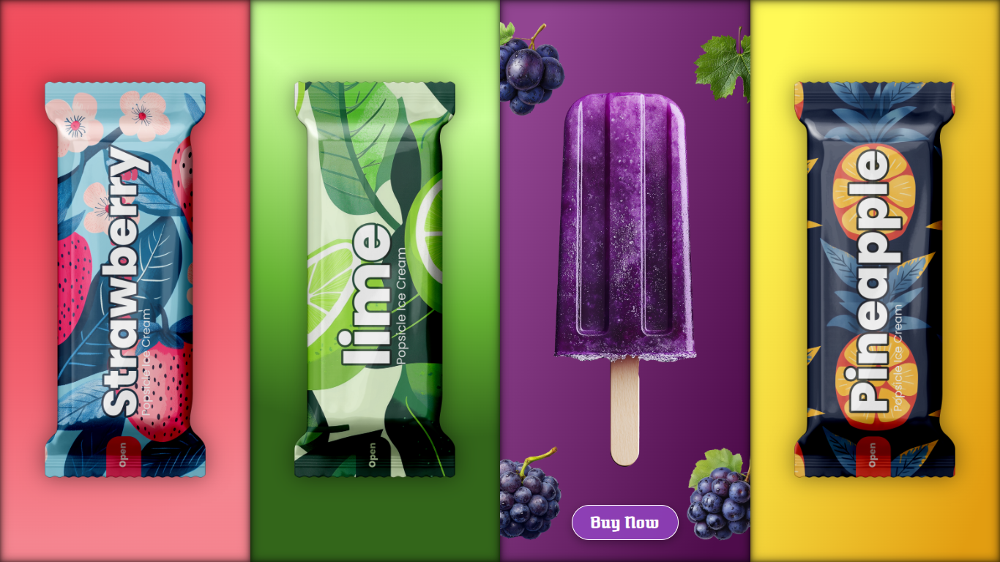
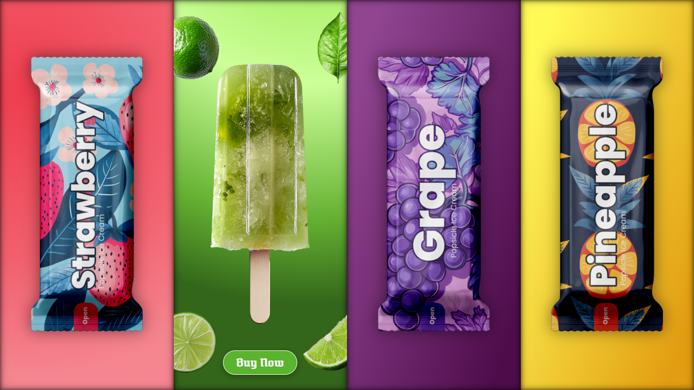

# 🍦 Interactive Ice Cream Showcase  

An interactive, animated landing page for different ice cream flavors.  
Built using **HTML, CSS, and JavaScript**, this project demonstrates hover animations, responsive design, and smooth transitions.  

---

## ✨ Features
- 🎨 **Beautiful gradients & shadows** for each flavor box  
- 🍓 **Hover animations** (ice cream grows, packets move, fruits rotate)  
- 📱 **Responsive design** with media queries for mobile & tablet  
- 🖱️ **Smooth transitions** using CSS & JavaScript event listeners  
- ⚡ Lightweight and fast  

---

## 📸 Preview  



---

## 🚀 Live Demo
👉 [View on GitHub Pages](https://icecream-showcase.vercel.app/)  

---

## 🛠️ Technologies Used
- **HTML5** – structure  
- **CSS3** – gradients, animations, responsive design  
- **JavaScript (Vanilla)** – hover interactions  

---

```bash
## 📂 Project Structure
📦 icecream-showcase
├── 📂 Elements # Fruit element images
├── 📂 Ice cream # Ice cream images
├── 📂 Pack # Packet images
├── index.html # Main HTML file
├── style.css # Stylesheet
└── README.md # Documentation
```
---

## 📝 License

This project is open-source and free to use under the [MIT License](LICENSE).

---

## 📱 Responsive Design
- **Desktop (1200px+)** – full-size layout  
- **Tablet (768px – 1200px)** – scaled ice cream & packet images  
- **Mobile (≤ 480px)** – stacked view, optimized assets  

---

## ⚡ How to Run
1. Clone the repo  
   ```bash
   git clone https://github.com/CodesByNitin/icecream-showcase.git
   ```
---

## 🙌 Credits

- **Inspiration**: [Video Link](https://youtu.be/2FxwD8Iyhzg?si=wXs8nPv3Ds-y3pWY)

---
